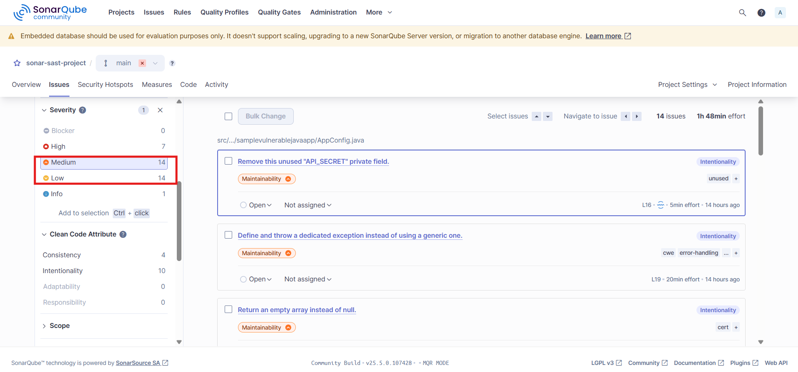
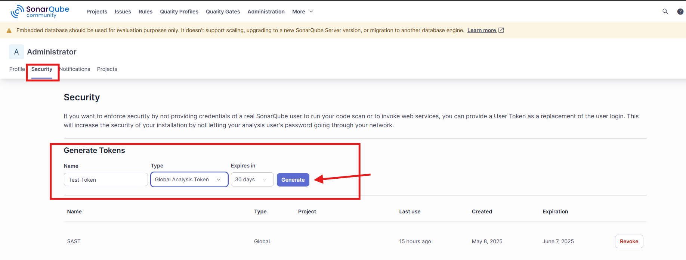
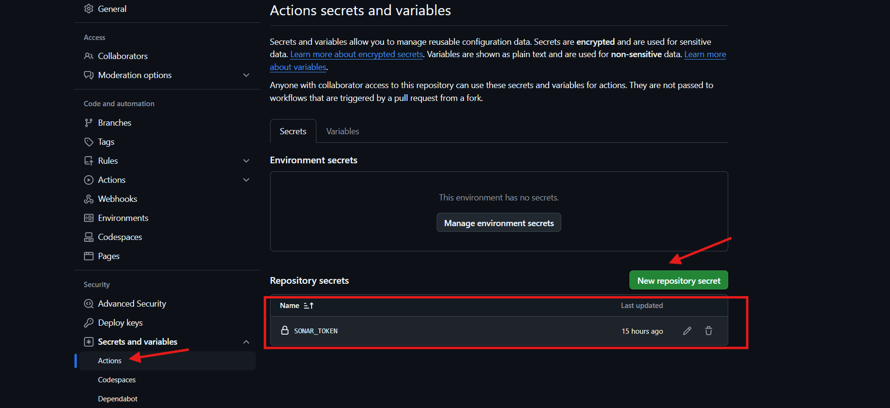

# SonarQube Integration for SAST (Static Application Security Testing)

## 1. Context: Why We Are Doing This

In this assignment, we are integrating **SonarQube** with our GitHub Actions pipeline to perform **Static Application Security Testing (SAST)** on the codebase. The purpose is to analyze the code for security vulnerabilities, particularly focusing on critical and medium-level vulnerabilities, and ensure that the application is secure by scanning every change made to the codebase.

### Why SonarQube?
- **SonarQube** is one of the most widely used tools for identifying security vulnerabilities, code smells, and bugs.
- By integrating SonarQube into the CI/CD pipeline, we can automate security checks and ensure that new code commits do not introduce vulnerabilities.
- SonarQube provides detailed insights into vulnerabilities and helps developers prioritize fixing issues based on severity levels like critical, major, and minor.

### Goal
The goal is to:
- **Integrate SonarQube into the GitHub Actions pipeline** for automated scanning.
- **Generate security vulnerability reports** (including severity levels) that can be viewed directly in SonarQube.
- **Create coverage reports** and track code quality over time.

---

## 2. Thought Process: PoC Details

### Initial Setup
To begin with, we needed to:
- Set up a **SonarQube instance** running in Docker. This instance would be used to analyze the codebase and generate reports.
- Use **GitHub Actions** as the CI/CD pipeline to automate the process of scanning the code using SonarQube.

The pipeline was designed with the following steps:
- **Checkout the repository** to ensure that the latest code is being analyzed.
- **Set up JDK 21**: Since the project was using Spring Boot and Java 21, setting up the correct JDK was crucial.
- **Build and test**: We ran the build and tests for the project and generated a **Jacoco coverage report**.
- **Run SonarQube scan**: Finally, we triggered the SonarQube scan to analyze the code for vulnerabilities.

### Problem Faced:
While setting up the SonarQube scan task, we faced the following issues:
  
- **SonarQube Token Issue**: Initially, there was some confusion around the **SonarQube token** and its usage in the pipeline.
  - **Solution**: We generated a SonarQube token and passed it securely through GitHub Actions secrets.

- **Missing Coverage Report Path**: SonarQube was not able to pick up the coverage report from Jacoco.
  - **Solution**: We updated the pipeline to explicitly define the **Jacoco report path** using the `-Dsonar.coverage.jacoco.xmlReportPaths` option.

- **Gradle Version Compatibility**: Our project used **Gradle 8.7**, and we encountered issues related to Gradle deprecation warnings (specifically regarding `compile` tasks).
  - **Solution**: We set the `sonar.gradle.skipCompile` property to `true` in the pipeline configuration to avoid compiling during the SonarQube scan.

---

## 3. Impact Analysis

### Performance Impact:
- **Positive Impact**: Integrating SonarQube into the CI/CD pipeline helps catch security issues early in the development process, reducing the risk of security vulnerabilities making it to production. This integration ensures that security is maintained with every code change.
- **Negligible Performance Overhead**: Running the SonarQube scan as part of the pipeline adds a small amount of time to the build process. However, this is a trade-off for ensuring code quality and security.

### Benefit:
- **Automated Vulnerability Detection**: Every time code is pushed to the main branch or a pull request is created, the pipeline runs the SonarQube scan automatically.
- **Security Insight**: SonarQube provides detailed vulnerability insights, such as critical, high, and medium vulnerabilities, which helps in timely remediation.
- **Coverage Reports**: By using Jacoco, we can also track the test coverage, ensuring that we maintain good test coverage over time.

### Disadvantage:
- **Pipeline Complexity**: The integration of SonarQube and Jacoco can make the pipeline more complex, requiring additional configuration. However, this complexity is justified by the benefits of continuous code quality and security scanning.

---

## 4. Conclusion

After successfully integrating SonarQube into the pipeline, we are now able to automatically scan for security vulnerabilities in the codebase. The SonarQube instance detects **critical**, **high**, and **medium** vulnerabilities and provides suggestions for fixing them. 

### Outcome:
- The **SonarQube report** shows various issues, categorized by their severity.
- We can now see a detailed report with insights into code quality, security vulnerabilities, and code coverage.
  
**Report Links**:


**We can see Report from github action job summary where those are storing as artifacts so user can download and see**


### Screenshots for Vulnerabilities:
- **Critical Vulnerabilities**: Show a screenshot of the critical vulnerabilities found in SonarQube.


- **Medium/Low Vulnerabilities**: Show a screenshot of medium and low vulnerabilities from the SonarQube dashboard.



- **Jaccoo Plugin integartion**: After integrating this plugin will see details coverage report in graphical format and we can also look by click on those objects


### Final Thoughts:
The integration of SonarQube into the pipeline has enhanced our ability to detect and fix vulnerabilities early in the development cycle. Going forward, we can easily add more rules to the SonarQube configuration to track different types of security issues as our application grows.

---

### Appendix: Steps for Integrating SonarQube

**1. Install SonarQube on Docker**
```bash
docker pull sonarqube
docker run --name sonarqube-custom -p 9000:9000 sonarqube
```

**2. Login to sonarqube change the password and generate PAT token**
To generate PAT go here



**3. Integrate sonarqube with github action pipeline to generate reports**

For that first we need create secret under github action and mount that as env variable in pipeline see below screenshot



Now integrate this secret in pipeline like this also provide sonar URL in same task


